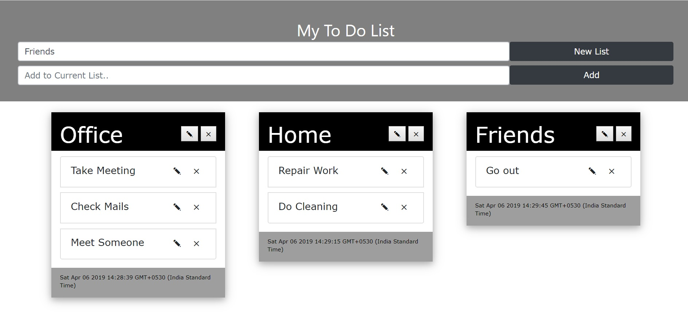
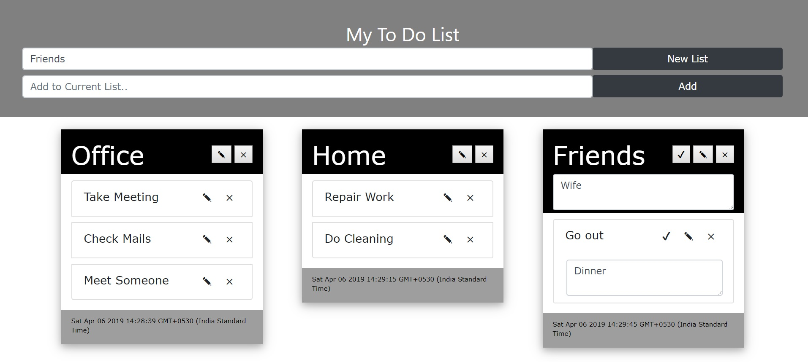

# FastTodo
A simple todo check list webapp with sortable task lists. 

Routing not added.
Demo App : https://jayzjayesh.github.io/FastTodo/

Usage:

1. Add new task lists and related tasks to it.

2. Interchange and sort tasks within task lists.

3. Edit and delete task lists and related tasks.

Future Use:

1. Different tasks lists can be sent to different users.
2. Each user can get notification on Mobile App regarding daily tasks.
